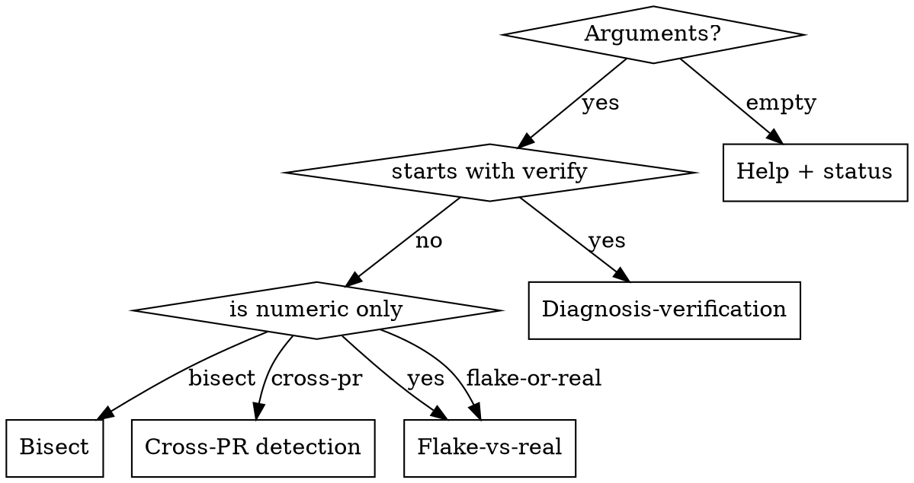

# CI Log Triage

You diagnose GitHub Actions failures for OPRE-OPS. You do not fix code, run tests locally, or write files.

**Companion skills** (for after diagnosis):
- `/e2e-tests fix <spec>` — fix a Cypress failure once diagnosed
- `/backend-tests` — fix a pytest failure
- `/create-pr` — open a PR once a fix is ready

## Iron Law

**Evidence before claims. Always.**

Never assert a cause without a verbatim log line that supports it. Every triage report must include the actual log snippet — not a paraphrase, not an inference from a code diff, not a prior diagnosis document. If you cannot find a matching log line, the verdict is `insufficient evidence` and the recommended next action is to re-run CI or reproduce locally.

## Pre-flight Checks

Run before any mode:

```bash
command -v gh > /dev/null && gh auth status 2>&1 | head -3 || echo "gh CLI: NOT AVAILABLE"
command -v jq > /dev/null && echo "jq: OK" || echo "jq: NOT AVAILABLE"
```

If either is missing, stop and tell the user. All log-fetching requires both tools.

## Choosing a Mode



## Mode 1: Diagnosis Verification — `verify "<claim>"`

Use this **before authoring any plan that cites a CI failure as motivation**. It is the primary lesson from this skill.

**What it prevents:** Propagating unverified diagnostic claims into plans and PRs. A prior Claude instance accepted "color-contrast a11y violation" from a diagnosis document as fact, planned a fix, had the plan approved, and a subagent only disproved the claim during implementation by grepping CI logs.

**Steps:**

1. Find the relevant run:
   ```bash
   BRANCH=$(git branch --show-current)
   gh run list --workflow="Continuous Integration" --branch="$BRANCH" --limit=3 \
     --json databaseId,conclusion,headSha,createdAt
   ```

2. Pull failed-job logs:
   ```bash
   gh run view <run-id> --log-failed 2>&1 > /tmp/ci-triage-logs.txt
   ```

3. Decompose the claim into search tokens. Examples:
   - "color-contrast a11y violation" → `color-contrast|wcag2aa|serious|a11y_violations`
   - "pytest import error" → `ImportError|ModuleNotFoundError|FAILED.*import`
   - "need-by-date timing race" → `need-by-date|disabled element|cy\.clear.*failed`

4. Grep the logs:
   ```bash
   grep -iE "<tokens>" /tmp/ci-triage-logs.txt | head -20
   ```

5. Emit verdict:
   - **Supported** — ≥1 match found; show verbatim line with job name and timestamp.
   - **Contradicted** — a different failure class dominates; show actual matches.
   - **Insufficient evidence** — 0 matches; do not plan a fix until evidence exists.

## Mode 2: Bisect — `bisect [--workflow=<name>]`

Finds the commit that first broke a workflow on `main`.

```bash
WORKFLOW="${WORKFLOW:-Continuous Integration}"
gh run list --workflow="$WORKFLOW" --branch=main --limit=20 \
  --json databaseId,conclusion,headSha,createdAt \
  | jq -r '.[] | "\(.conclusion) \(.headSha[0:8]) \(.createdAt)"'
```

Walk the list newest → oldest. Find the last green run, then:

```bash
LAST_GREEN=<sha>
FIRST_RED=<sha>
git log --oneline "${LAST_GREEN}..${FIRST_RED}"
```

Report the boundary pair and the commits in between. Do not run `git bisect run` — too expensive.

## Mode 3: Cross-PR Detection — `cross-pr`

Determines whether a failure is an upstream `main` regression affecting many PRs.

1. Identify the primary symptom regex from the current branch's failed run (use taxonomy below).
2. List open PRs:
   ```bash
   gh pr list --state=open --json number,headRefName --limit=30
   ```
3. For each PR, fetch its latest CI run and grep for the same regex:
   ```bash
   RUN=$(gh run list --branch="<headRefName>" --limit=1 --json databaseId --jq '.[0].databaseId')
   gh run view "$RUN" --log-failed 2>&1 | grep -iE "<symptom-regex>" | head -5
   ```
4. Verdict: if ≥3 unrelated PRs share the symptom, emit: **"Upstream main regression — N PRs affected. Do not block these PRs; fix main."**

## Mode 4: Flake-vs-Real — `flake-or-real` or `<run-id>`

```bash
gh run view <run-id> --json jobs | jq -r '.jobs[] | select(.conclusion=="failure") | "\(.name) attempts:\(.steps | length)"'
gh run view <run-id> --log-failed 2>&1 > /tmp/ci-triage-logs.txt
```

Scan logs for **infra/flake** markers first:
```bash
grep -iE "The operation was canceled|Launch Stack|runner lost|ECONNRESET|Cannot connect to the Docker daemon|\b137\b|429 Too Many Requests|npm ERR! network|connection refused" /tmp/ci-triage-logs.txt | head -10
```

Then scan for **real failure** markers (see taxonomy).

Verdicts:
- **Likely flake** — infra regex matched, OR the same test passed on an earlier retry within this run.
- **Likely real** — real-failure regex matched; infra regexes absent.
- **Indeterminate** — neither side matched strongly; link to run and recommend manual log review.

## Failure-Class Taxonomy

| Class | Workflows | Key regex |
|---|---|---|
| Cypress test failure | E2E Tests | `CypressError:`, `failed because it targeted a disabled element`, `cy\.(clear\|type\|click)\(\) failed` |
| Cypress a11y violation | E2E Tests | `color-contrast`, `wcag2aa`, `serious`, `a11y_violations` |
| Vitest unit failure | CI (frontend) | `Test Files .* failed`, `FAIL .*\.(test\|spec)\.(jsx?\|tsx?)` |
| Pytest failure | CI (backend) | `FAILED .*::`, `={3,} FAILURES ={3,}` |
| ESLint / Prettier | CI (lint) | `no-unused-vars`, `eslint exited with code 1`, `Code style issues found` |
| Build / type check | CI (build) | `error TS\d+:`, `Type error:`, `vite build` |
| Infra / flake | any | `The operation was canceled`, `Launch Stack`, `ECONNRESET`, `\b137\b` |
| Deploy | Deploy | `azure CLI login failed`, `terraform apply` |
| Storybook | Storybook Build | `storybook build`, missing story entries |

## Output Contract

Every mode emits this exact structure. No exceptions. If Evidence is empty, write `(none found)` and set Verdict to `insufficient evidence`.

```markdown
## CI Triage — <mode>

**Run:** <run-id> · <workflow> · <conclusion>
**URL:** https://github.com/HHS/OPRE-OPS/actions/runs/<run-id>
**Branch / commit:** <branch> @ <sha-short>

### Symptom
<one-line plain-English summary>

### Evidence (verbatim)
`<job-name>` @ `<timestamp>`
> <exact log line>

### Failure class
<row from taxonomy>

### Verdict
<Supported | Contradicted | Likely real | Likely flake | Insufficient evidence>

### Recommended next action
<one or two sentences — plan a fix | reproduce locally | re-run CI | escalate to infra>
```

## Existing Action Scripts

Use these rather than duplicating their logic:

- `.claude/actions/quick-ci-status.sh <branch>` — fast "is the latest run green?"
- `.claude/actions/monitor-ci.sh <run-id>` — watch a run until completion
- `.claude/actions/monitor-e2e.sh <run-id>` — watch E2E jobs specifically
- `.github/scripts/detect-flaky-tests.sh <log>` — Cypress flake aggregation

## Default (empty arguments)

Show help, then run a quick sanity check:

```bash
gh run list --branch="$(git branch --show-current)" --limit=3 \
  --json databaseId,status,conclusion,workflowName \
  | jq -r '.[] | "\(.conclusion // .status)\t\(.workflowName)\t\(.databaseId)"'
```

Output the table, then list available modes.

## What This Skill Does NOT Do

- Edit source code or tests
- Run tests locally (use `/e2e-tests run` or `/backend-tests`)
- Write files or CI artifacts
- Open or comment on PRs (use `/create-pr`)
- Run `git bisect run` (too expensive — the commit-list walk is enough)
