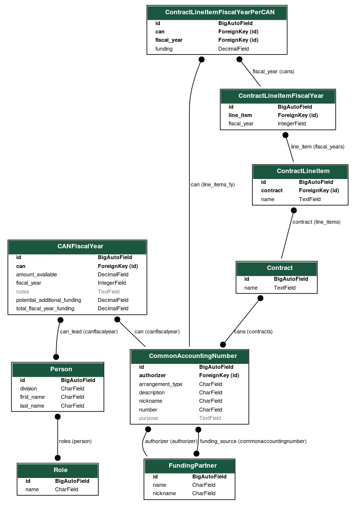

# OPRE OPS
[](https://github.com/pre-commit/pre-commit)
[](https://github.com/psf/black)

This is the OPRE's Research Portfolio Management System, or OPS. The finished product will replace OPRE's prior system,
[MAPS](https://github.com/HHS/MAPS-app). The purpose of OPS can be found on
[the wiki](https://github.com/HHS/OPRE-OPS/wiki).

## Dependencies

At a bare minimum, you need [Docker](https://www.docker.com) installed to run the application locally.  If you want to do
development, you will also need to install [Python](https://www.python.org), [Node.js](https://nodejs.org), and
[pre-commit](https://pre-commit.com/#installation).

## Install

### Backend

We use [pipenv](https://pipenv.pypa.io) to manage our Python dependencies.  Follow the directions on their website to
install it on your machine.

To install the dependencies, run...

```shell
cd ./backend/
pipenv install --dev
```

### Frontend

We use [yarn](https://yarnpkg.com) to manage our Node.js dependencies.  It comes by default with Node.js.

To install the dependencies, run...

```shell
cd ./frontend/
yarn install
```

## Run

We have a Docker Compose configuration that makes it easy to run the application.

```shell
docker compose up
```

To create an admin user, use the Django management tool from within the container.

```shell
docker compose exec backend python ./opre_ops/manage.py createsuperuser
```

## Access

Whether you run the application through Docker or locally, you can access the frontend at `http://localhost:3000` and
the backend at `http://localhost:8080`.

There remains an administrative interface for the backend that you can access at `http://localhost:8080/admin/`

## Checks

### Unit Tests

#### Backend

TBD.  Pytest, etc.

#### Frontend

The frontend tests are implemented through [Jest](https://jestjs.io).

To run them...

```shell
cd ./frontend/
yarn test --watchAll=false
```

This runs them once and then exits.  You can remove the `--watchAll=false` if you want to continually rerun the tests
on each file save.

You can also get code coverage information by running...

```shell
cd ./frontend/
yarn test:coverage --watchAll=false
```

We require 90% code coverage.

### End-to-end Tests

TBD.

### Linting

#### Backend

The backend linting is implemented using [flake8](https://flake8.pycqa.org).  We use [nox](https://nox.thea.codes) as
the runner to execute `flake8`.

To run linting...

```shell
cd ./backend/
pipenv run nox -s lint
```

The linter may complain about violations in the [Black](https://black.readthedocs.io) code formatting.  To automatically
fix these issues, run...

```shell
cd ./backend/
pipenv run nox -s black
```

#### Frontend

The frontend linting is implemented through [ESLint](https://eslint.org).

To run linting...

```shell
cd ./frontend/
yarn lint
```

You can automatically fix many linting errors by passing in `--fix`.

```shell
cd ./frontend/
yarn lint --fix
```

### Pre-commit Hooks


=====

## Deployment

Prototype deployed at https://opre-ops-frontend-test.app.cloud.gov/

**Warning:** This prototype uses `runserver` as a web server, which is considered insecure
for production use. This should be replaced with something like `gunicorn` and
`nginx` before it is deployed beyond prototyping purposes.

OPS is deployed:
* as a [Cloud.gov application](https://dashboard.fr.cloud.gov/applications)
* backed by a [Cloud.gov database service](https://dashboard.fr.cloud.gov/services)
* via GitHub Actions

When this CI/CD pipeline is configured and running, deployment happens automatically any time a pull request to the development branch is merged.

To set up or modify the CI/CD pipeline, ensure you:
* have a Cloud.gov app named `opre-ops-test`
* have a service named `opre-ops-psql-db`
* conntect the app and service with `cf bind-service opre-ops-test opre-ops-psql-db`
* [configure egress](https://cloud.gov/docs/management/space-egress/). You may need to run `cg bind-security-group trusted_local_networks_egress [org] --space [space]` to allow the app to reach the database.
* run `cf restage opre-ops-test` after making configuration changes

For prototyping and testing purposes, you should load the test fixture data
in this repo. The best way to do that is to SSH into the cloud.gov container and
execute the Django `loaddata` command:

* `cf ssh opre-ops-test` to get into the container. Once you have a shell in
  the container, you'll need to [configure the shell](
  https://docs.cloudfoundry.org/devguide/deploy-apps/ssh-apps.html#ssh-env)
  to match the app runtime's environment.
* `/tmp/lifecycle/shell` will run the built-in cloud.gov buildpack command that
  configures your shell so that its environment matches the runtime's. This
  includes the correct version of Python, making sure all of the dependencies
  are in the Python environment, and configuring environment variables from the
  database service.
* `cd opre_ops`
* `python manage.py loaddata ./ops_site/fixtures/fake_data.json`

## Data model

The data model diagram below shows all of the tables used by OPS and
relationships between those tables. Lines between tables mean they are related.
If a line has a circle on one end, that means the table ***without a circle***
has a one-to-many relationship with the table ***with a circle*** (modeled with
a foreign key from the circle-table to the not-circle-table). If a line
has circles on both ends, the tables have a many-to-many relationship (modeled
with mapping/cross-reference tables).



This diagram is also available as a [DOT file](docs/models.dot). (DOT is a
[graph description
language](https://en.wikipedia.org/wiki/DOT_(graph_description_language)). It
can be used to represent graph relationships in plain text.) To update this
visualization, first use the django-extensions module to create a new
DOT file:

```sh
docker-compose run backend \
  python manage.py \
  graph_models \
  -a \
  -X LogEntry,AbstractUser,Permission,Group,User,ContentType,AbstractBaseSession,Session \
  > docs/models.dot
```

Then use graphviz to convert the dotfile to a PNG image:

```
docker run -it --rm -v "$(pwd)/docs":/work -w /work \
  fgrehm/graphviz \
  dot -Tpng models.dot -omodels.png
```

(No, there should not be a space between `-o` and `models.png`. It might work
with a space, but the official documentation concatenates them together, so it is
documented that way here.)

## Pre-Commit

Please follow the [pre-commit installation](https://pre-commit.com/#installation) methods to ensure you are setup to run pre-commmits out-of-the box.

### [pre-commit](https://github.com/pre-commit/pre-commit-hooks) (base)
* [detect-aws-credentials](https://github.com/pre-commit/pre-commit-hooks#detect-aws-credentials)
* [detect-private-key](https://github.com/pre-commit/pre-commit-hooks#detect-private-key)
* [trailing-whitespace](https://github.com/pre-commit/pre-commit-hooks#trailing-whitespace)
* [end-of-file-fixer](https://github.com/pre-commit/pre-commit-hooks#end-of-file-fixer)
* [check-json](https://github.com/pre-commit/pre-commit-hooks#check-json)
* [check-yaml](https://github.com/pre-commit/pre-commit-hooks#check-yaml)
* [check-added-large-files](https://github.com/pre-commit/pre-commit-hooks#check-added-large-files)
* [check-merge-conflict](https://github.com/pre-commit/pre-commit-hooks#check-merge-conflict)

### IBM's [Detect-Secrets](https://github.com/ibm/detect-secrets)
There's internal debate whether to use Yelp's version or IBM's version (a fork of Yelp's). We can work this out, but starting with IBM's version in the interum.

### [Hadolint](https://github.com/hadolint/hadolint) Dockerfile linting
Debating whether this is needed if containers will only be used for development, and rely on the buildpack for production, but better to have for now.

### Python [Black](https://github.com/psf/black)
Defacto Python linting. No additional configs at this time.
