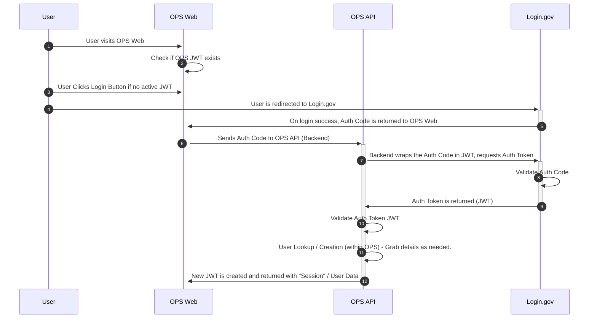

# 15. Login.gov (AuthN)

Date: 2022-10-04

## Decision

Login.gov will be used as the central OIDC Provider for user authentication for OPS.

## Status

Accepted.

## Context

Login.gov is a FedRAMP moderate approved multifactor authentication and identity proofing platform that makes online interactions with the U.S. government simple, efficient and intuitive. Supporting both OIDC and SAML, we've opted to utilize OIDC with the "Authorization Flow", as Login.gov does not support nor should "implicit flow" be used. The flow can be be visualized below.

One of the core decisions to utilize Login.gov is the built-in support for PIV/CAC cards for 2FA (Two-Factor Authentication).

At this time, we only plan on utilizing Identity Assurance Level 1 (IAL1) attributes of the user, specifically `uuid`,`email`, and `verified_at` values.

Further discussion and experiments took place to determine whether PKCE or JWT would be used for obtaining the `Auth Token` from Login.gov; utlimately we determined we'd utilize JWT, since we'll be generating a JWT for user management anyway. This also ensures the majority of the authentication code remains in the backend, instead of on the client.

## Diagram

### Related issues

#447
