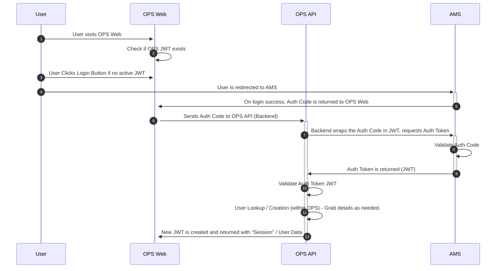

# 24. HHS AMS (AuthN)

Date: 2023-08-23

## Status

Accepted

## Context

The Department of Health and Human Services (HHS) operates an Access Management System (AMS) that is a FedRAMP moderate approved multifactor authentication and identity management platform. AMS is the prescribed authentication provider of choice for HHS/ACF offices such as OPRE. Supporting both OpenID and SAML, we've opted to use OpenID. The data flow is visualized below.

A core aspect of AMS is native support for PIV/CAC cards for 2FA (Two-Factor Authentication).

## Decision

HHS AMS will be used as the central AuthN Provider for user authentication for OPS.

## Diagram

### Related issues

#447 and #1206
