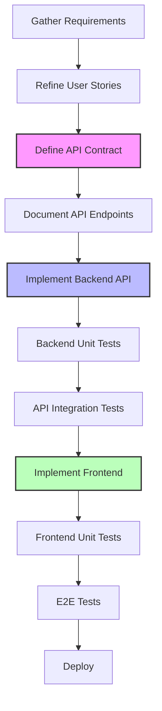
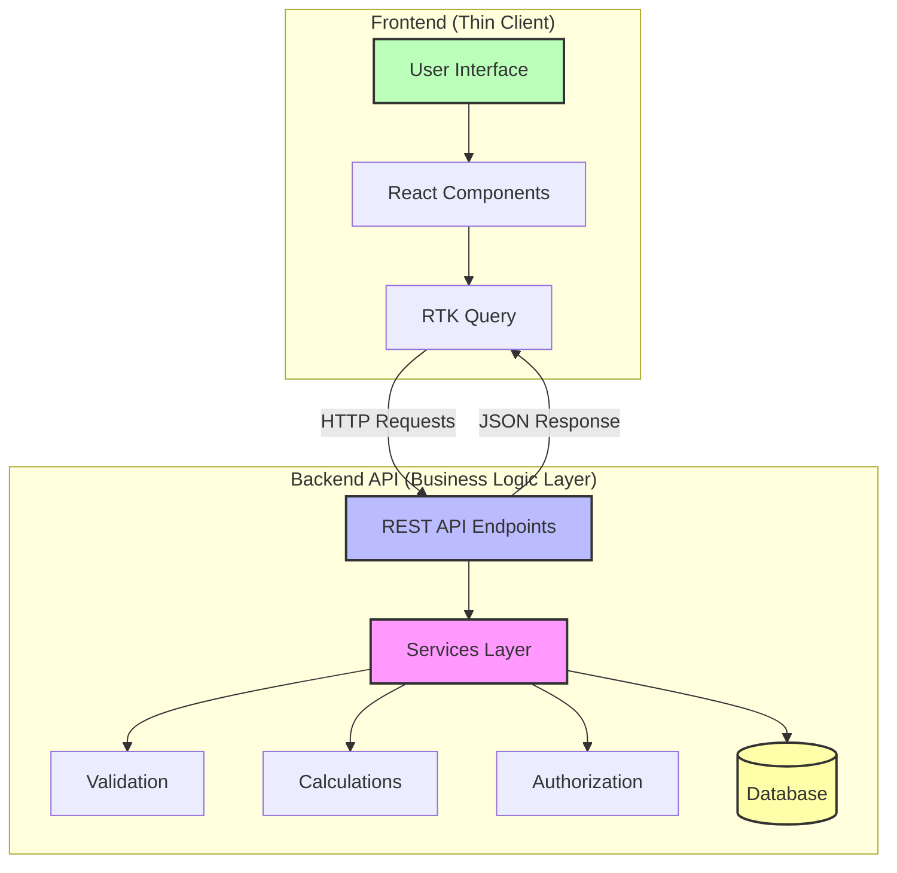
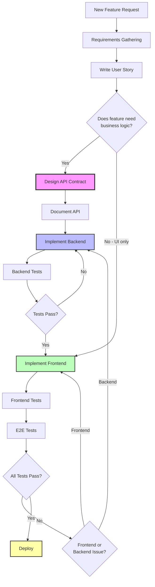
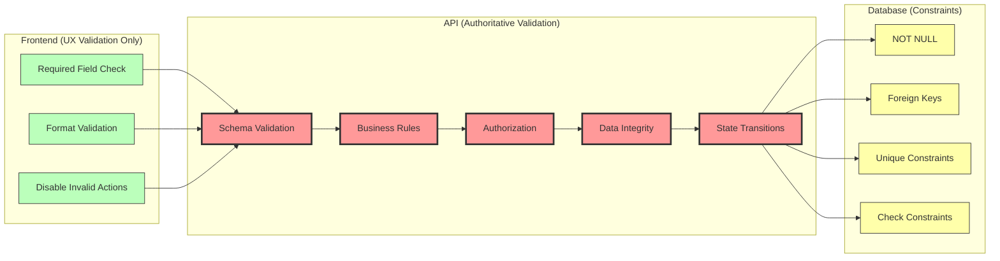

# 30. API-First Development

Date: 2025-12-09

## Status

Accepted

## Context

API-first development is a design philosophy where the API contract is defined and developed before the frontend
implementation. The API serves as the single source of truth for all business logic, data validation, calculations, and
rules, while frontend applications are treated as thin clients that consume the API.

### What is API-First Development?

In an API-first approach:

1. **Requirements** are gathered and refined into user stories
2. **API contracts** are designed and documented (endpoints, request/response schemas, validation rules)
3. **Backend implementation** delivers the API with all business logic
4. **Frontend implementation** consumes the API as a presentation layer

This contrasts with frontend-first development (where UI is built first, then backend is retrofitted) or simultaneous
development (where frontend and backend are built in parallel).

### Why API-First Matters in Government and Enterprise Development

Government technology and enterprise systems have unique requirements that make API-first development particularly
valuable:

#### 1. **Regulatory Compliance and Auditability**

- Government systems must comply with strict regulations (FISMA, FedRAMP, accessibility standards)
- Having all business logic in one place (the API) makes compliance easier to verify and audit
- Changes to rules and calculations are centralized and traceable

#### 2. **Multiple Client Applications**

- Government systems often need multiple frontends: web applications, mobile apps, internal tools, partner integrations
- A well-designed API serves all clients consistently without duplicating logic
- Future clients can be added without backend changes

#### 3. **Long-Term Maintainability**

- Government systems have long lifecycles (10+ years)
- Frontend frameworks change frequently (Angular → React → Next.js → future frameworks)
- Business logic in the API remains stable even as frontends are replaced

#### 4. **Data Integrity and Security**

- Government systems handle sensitive data (PII, financial data, program information)
- Centralizing validation and business rules in the API prevents data corruption from client-side bypass
- Security controls are enforced consistently regardless of client

#### 5. **Interoperability**

- Government systems must integrate with other agencies and systems
- A well-designed API enables machine-to-machine communication
- Supports open data initiatives and public APIs

#### 6. **Clear Separation of Concerns**

- Frontend teams focus on user experience
- Backend teams focus on business logic and data integrity
- Teams can work in parallel once API contract is defined

## Decision

OPRE OPS follows an API-first development methodology where:

1. **All business logic resides in the backend API**
    - Calculations (budget totals, fees, aggregations)
    - Validation rules (data integrity, business constraints)
    - Authorization and access control
    - State transitions and workflows

2. **The frontend is a thin client**
    - Presents data to users
    - Handles user interactions and routing
    - Performs minimal client-side validation (for UX only)
    - Defers to API for all authoritative decisions

3. **Development workflow follows this sequence:**
    - Gather and refine requirements
    - Write user stories with acceptance criteria
    - Design API contract (endpoints, schemas, validation)
    - Implement and test backend API
    - Implement frontend to consume API
    - Integration testing

### Development Workflow



### Architecture: Thin Client Pattern



### Why Business Logic Belongs in the API

#### 1. **Single Source of Truth**

Business rules change frequently in government systems (new policies, budget rules, compliance requirements). Having one
authoritative implementation prevents inconsistencies.

**Example**: Budget line item fee calculations in OPRE OPS

- Fee percentages, subtotals, and totals are calculated by `backend/ops_api/ops/services/budget_line_items.py`
- Frontend displays the results but doesn't recalculate
- If fee rules change, only one place needs updating

#### 2. **Data Integrity**

Client-side validation can be bypassed (browser dev tools, API calls from other clients, malicious actors). Server-side
validation is the only trustworthy validation.

**Example**: Agreement status transitions

- API enforces valid state transitions (Draft → In Review → Approved)
- API prevents invalid transitions (Approved cannot go back to Draft without workflow)
- Frontend displays available actions, but API enforces rules

#### 3. **Consistency Across Clients**

With multiple clients (web, mobile, internal tools, partner APIs), business logic must be consistent.

**Example**: Budget line item totals

- Web frontend, Excel export, API integrations all see same calculations
- No risk of different clients implementing calculations differently
- Reports and dashboards are guaranteed to match user-facing totals

#### 4. **Testability**

Backend unit tests can verify business logic in isolation without browser automation or UI concerns.

**Example**: Testing budget calculations

- `backend/ops_api/tests/ops/services/test_budget_line_items.py` tests all calculation scenarios
- Tests run in milliseconds without browser overhead
- Edge cases and error conditions are easy to test

#### 5. **Performance and Scalability**

Complex calculations and aggregations are more efficient on the server with direct database access.

**Example**: Portfolio-level budget rollups

- API can use SQL aggregations to sum across thousands of budget lines
- Frontend receives pre-calculated totals
- Reduces network payload and client-side processing

### Why Frontend Should Be a Thin Client

#### 1. **Separation of Concerns**

Frontend focuses on what it does best: user experience, accessibility, visual design. Backend focuses on data integrity
and business rules.

#### 2. **Framework Independence**

Business logic doesn't depend on React, Redux, or any frontend framework. When frameworks change, business logic is
unaffected.

#### 3. **Reduced Frontend Complexity**

Frontend code is simpler and easier to maintain when it's primarily concerned with presentation.

**Example**: Agreement approval workflow

- Frontend: Shows "Approve" button if user has permission
- Backend: Validates user permissions, checks business rules, updates state
- Frontend doesn't need to understand all the approval rules

#### 4. **Better Error Handling**

API returns structured error messages with field-level validation errors. Frontend displays these errors but doesn't
duplicate validation logic.

#### 5. **Offline-First Capabilities**

When offline functionality is needed, the thin client can cache API responses and replay mutations when reconnected,
without implementing business logic offline.

## Options Considered

### Option 1: API-First Development (Chosen)

**Approach**: Design and implement API before frontend.

**Advantages:**

- Single source of truth for business logic
- Easier to maintain and modify rules
- Consistent behavior across all clients
- Better security and data integrity
- Clear separation of concerns
- Testable business logic
- Framework-independent core system

**Disadvantages:**

- Requires upfront API design
- Frontend development cannot start until API contract is defined
- May require API changes if frontend needs are underestimated

**Why chosen**: Best fit for government/enterprise systems with compliance requirements, long lifecycles, and multiple
clients.

### Option 2: Frontend-First Development

**Approach**: Build UI first, then create backend to support it.

**Advantages:**

- Rapid prototyping and user feedback
- UI/UX can be explored early
- Stakeholders see visual progress quickly

**Disadvantages:**

- Business logic often ends up in frontend
- Backend becomes a "database wrapper"
- Difficult to add new clients later
- Inconsistent behavior across clients
- Harder to maintain and test
- Security vulnerabilities (client-side validation only)

**Why rejected**: Incompatible with government requirements for data integrity, security, and long-term maintainability.

### Option 3: Simultaneous Development

**Approach**: Build frontend and backend in parallel.

**Advantages:**

- Potentially faster initial development
- Teams can work independently

**Disadvantages:**

- API changes require frontend rework
- Encourages tight coupling
- Business logic may be split between layers
- Integration problems discovered late
- Inconsistent validation (client vs server)

**Why rejected**: Higher risk of rework and inconsistencies. Works better for small projects, not enterprise systems.

### Option 4: Backend-For-Frontend (BFF) Pattern

**Approach**: Create specialized backend services for each frontend.

**Advantages:**

- Each frontend gets optimized API
- Frontend-specific needs are easy to meet

**Disadvantages:**

- Duplicates business logic across BFFs
- More services to maintain
- Inconsistencies between BFFs
- Higher operational complexity

**Why rejected**: Overkill for OPRE OPS scale. API-first with well-designed endpoints serves all clients adequately.

## Consequences

### Positive Consequences

1. **Maintainability**: Business logic changes happen in one place
2. **Security**: All validation and authorization enforced server-side
3. **Consistency**: All clients see the same data and rules
4. **Testability**: Business logic can be thoroughly tested without UI
5. **Scalability**: Backend can be scaled independently of frontend
6. **Auditability**: All state changes logged in backend with full context
7. **Future-Proofing**: Frontend can be replaced without changing business logic
8. **API Reusability**: API can be used by future systems, integrations, and automations

### Negative Consequences

1. **Upfront Design Required**: API contract must be thoughtfully designed before frontend work
2. **Potential Over-Engineering**: May create API endpoints that frontend doesn't fully utilize
3. **Learning Curve**: Developers must understand REST principles, API design, and thin client patterns
4. **Coordination Overhead**: Frontend and backend teams must coordinate on API contract

### Implementation Guidelines

#### For Backend Developers

1. **Design APIs as contracts**: Think about all possible clients, not just the current frontend
2. **Be generous with responses**: Include all data clients might need
3. **Be strict with inputs**: Validate everything, trust nothing from clients
4. **Return structured errors**: Field-level validation errors with clear messages
5. **Document everything**: OpenAPI/Swagger specs for all endpoints
6. **Version APIs**: Use versioning strategy for breaking changes

#### For Frontend Developers

1. **Trust the API**: Don't duplicate validation or calculations
2. **Display API responses**: Show errors, totals, and data exactly as API returns them
3. **Minimal client-side validation**: Only for UX (e.g., disable submit until required fields filled)
4. **Handle loading and error states**: API calls are async, handle all states gracefully
5. **Use API types**: Derive TypeScript/PropTypes from API schemas
6. **Don't work around the API**: If API doesn't meet needs, request API changes

### Real-World Example: Budget Line Item Fee Calculation

**❌ Wrong Approach (Frontend calculates)**:

```javascript
// Frontend calculates fee - AVOID THIS
const calculateFee = (budgetLines, feePercentage) => {
    const subtotal = budgetLines.reduce((sum, line) => sum + line.amount, 0);
    return subtotal * (feePercentage / 100);
};
```

**✅ Correct Approach (API calculates)**:

```javascript
// Frontend uses API calculation
const agreement = useGetAgreementQuery(agreementId);
const {fees, subtotal, total} = agreement.data.budget_line_items_summary;
```

Backend implementation in `backend/ops_api/ops/services/budget_line_items.py`:

```python
def calculate_agreement_totals(agreement):
    """Calculate budget totals with fees (single source of truth)"""
    subtotal = sum(bli.amount for bli in agreement.budget_line_items)
    fee = subtotal * (agreement.fee_percentage / 100)
    total = subtotal + fee
    return {"subtotal": subtotal, "fees": fee, "total": total}
```

### Decision Flow Diagram



### Validation Layers Diagram



## Related Issues

- See `CLAUDE.md` for implementation examples and conventions
- Backend structure: `backend/ops_api/ops/` (API layer), `backend/models/` (data layer)
- Frontend API integration: `frontend/src/api/opsAPI.js` (RTK Query configuration)
- Fee calculation bug (documented in `CLAUDE.md`): Common pitfall of frontend duplicating backend calculations
