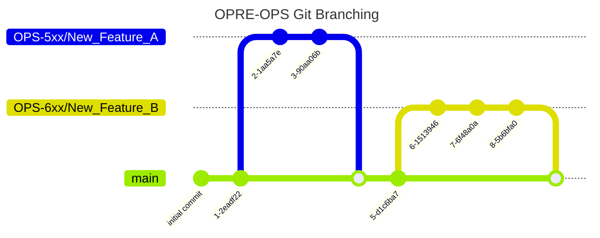

# OPRE-OPS Branching Strategy

The OPRE Team currently uses the following branching strategy:
### main
* `main` is the default and primary branch. This will always be the most up-to-date released code base.
* `main` currently has branch protections in place, and requires a `pull request` with at least `2` approvals from someone on the `dev team`.

### Feature Branches
* Features should branch from `main` and utilize a naming format of `OPS-{Issue#}/{Feature_Name}`, example: `OPS-522/CAN_Details_Page`.

# OPRE-OPS Release Strategy

The OPRE Team currently uses the following release strategy:

- When a PR is merged to `main` the GitHub Action `release.yml` will automatically create a new release in
GitHub with next version number.
- The `main` branch will be tagged with the new version number.
- The release will be published to the [GitHub Releases page](https://github.com/HHS/OPRE-OPS/releases).
